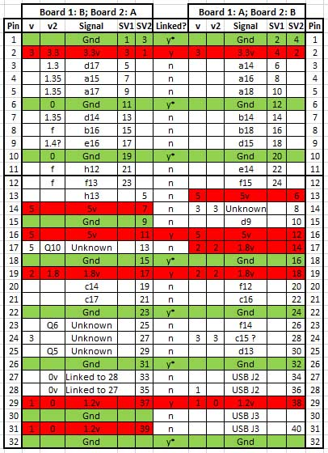

# Breakout Board

This board was created to provide direct access to FPGA pins to facilitate reverse engineering efforts, and to enable *hardware* connectivity to external hardware devices. It works by breaking out connections between the two boards that are not critical to the G2’s function. These are the connections to the Chrontel DVI chip, the LEDs and the switch. Access to these devices is lost, but all (most) other connections are passed straight through. Access to any of the lost devices can easily be restored by solder links, but then obviously the relevant FPGA pins are no longer broken out. This version provides 16 fully accessible FPGA pins on SV1 plus 3.3v and Gnd.

The board exists, works, and has been tested, although it should be clear it is intended as a prototype / proof of concept, and a number of fairly obvious improvements could to be made in a new version.

OEM link board, showing both sides.

Connections are broken out into two connectors - **SV1** - FPGA connections that can be reused (plus 3.3v and ground) and **SV2** - Connections critical to the G2 functionality - mainly power and ground. The table consists of two parallel parts - the columns on the left marked *Board 1: B; Board 2: A* mean the connections marked as B on board 1, and A on board 2, and the columns on the right A b1 and B b2. A look at the photo below showing the connectors should make things clearer. Linked refers to the prescence of vias; Links 27 & 28 are connected to each other. A glance at the table will see that the layout is far from perfect (remember this is a prototype) some  FPGA pins are stranded on SV2, these are accessible if you push the IDC pins out of the connectors before assembly (not as in the assembled board shown below). I think I got bored trying to route the PCB while keeping it as single layer double sided, and decided to go with what I had. 

The convention used here is that blah blah blah

Circuit diagrm - as you can see, not all that sophisticated. Eagle files are in *files* folder (soon, when I find and check them :-) )

The two boards are mirror images of each other.

A couple of views complete with connectors. IDC only really needs to be attached to SV1 (24pin on the right) on the board that fits the main PCB, but has been fitted to both bobs here so I could reinstate any original functionality via link cables (eg the LEDs or switch, or, if I discovered I'd actually severed any critical connections by accident :-) ).

 

G2 in full breakout mode with eBay USB<->serial adapter attached. In this version you can see I have pushed the IDC pins in SV2 to make all the FPGA pins accessible.
