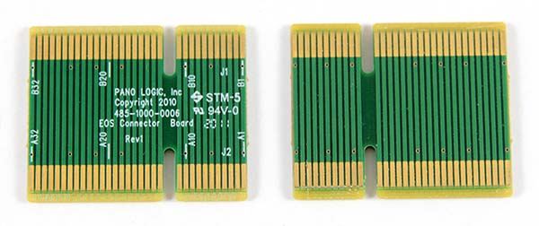
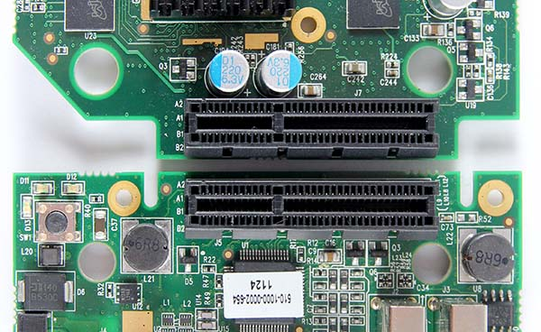
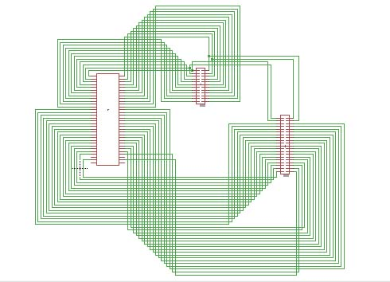
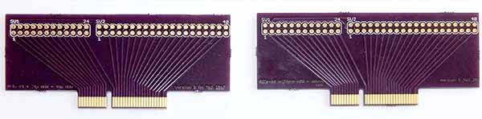
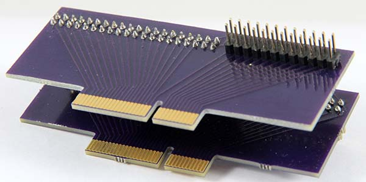
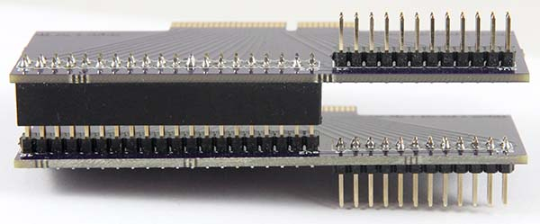
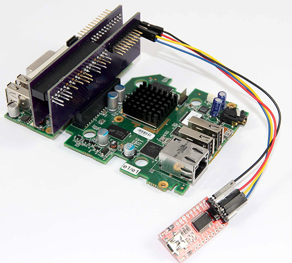

# Breakout Board

This board was created to provide direct access to FPGA pins to facilitate reverse engineering efforts, and to enable *hardware* connectivity to external hardware devices. It works by breaking out connections between the two boards that are not critical to the G2’s function. These are the connections to the Chrontel DVI chip, the LEDs and the switch. Access to these devices is lost, but all (most) other connections are passed straight through. Access to any of the lost devices can easily be restored by solder links, but then obviously the relevant FPGA pins are no longer broken out. The fully broken out configuration provides xxx accessible FPGA pins.

The board exists, works, and has been tested, although it should be clear it is intended as a prototype / proof of concept, and a number of fairly obvious improvements need to be made for the next version.

OEM link board, showing both sides.

< table of connections >

The convention used here is that blah blah blah

Circuit digarm - as you can see, not all that sophisticated. Eagle files are in *files* folder.

The two boards are mirror images of each other.

A couple of views complete with connectors

 

G2 in full breakout mode with eBay USB / serial adapter attached

 

