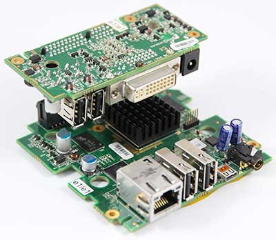
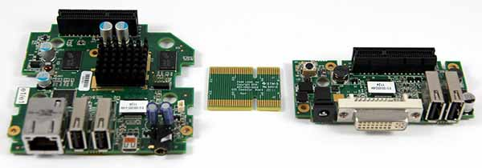
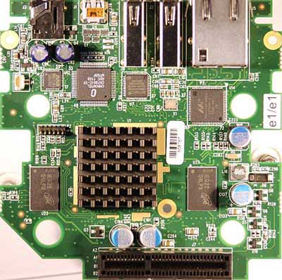
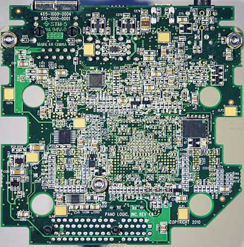
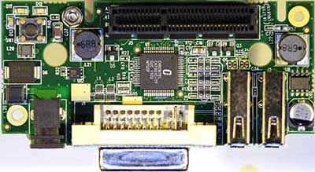
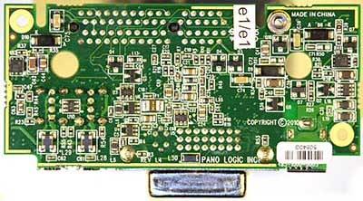

# Physical Description

I think the physical description of these devices has been done to death elsewhere, so I'll just put up my photos. 

As ever, hi-res versions in *images*.

Overview

Components - connecting board is just a pass through, except when there is power on both sides, when they are connected via a via. :-) The connector itslef is a standard PCI x4 connector.

Main board Top

Main Board - Bottom

Board 2 - this contains all the power regulators, the major connectors, and the 2nd Chrontel DVI chip.

Board 2 - Bottom
