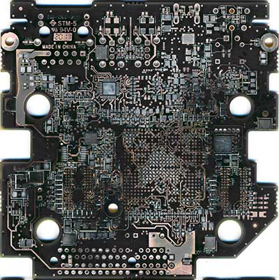

# Reverse Engineering

Connecting an eBay clone Xilinx Platform Cable USB connector to the JTAG (1.2mm pitch connector) showed that the device was straightforward to program. Using the /Universal Scan/ boundary scan software (http://www.ricreations.com/boundary-scan-products.html - free 14 day trial!), with judicious use of shorting to gnd or 3.3V provided a very straightforward (if tedious) way to determine FPGA connectivity. Fortunately most, if not all, FPGA connections were accessible using VIAs.

Sadly, once this was completed, I discovered @cyrozap - who had completed the same task in parallel with me, and produced a .ucf file. I've compared this with my empirically derived data, and there is almost a complete match.

< photo programmer connected >

A set of bare boards was created by stripping of the components, and careful sanding. This was done to assist the process of reverse engineering the discreet component connectivity. The photos are still a work in progress, but here they are:

